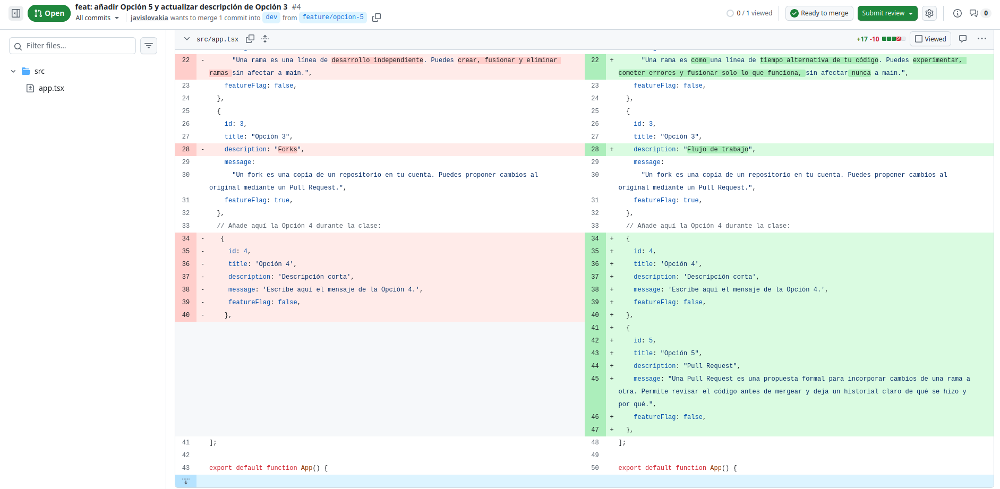
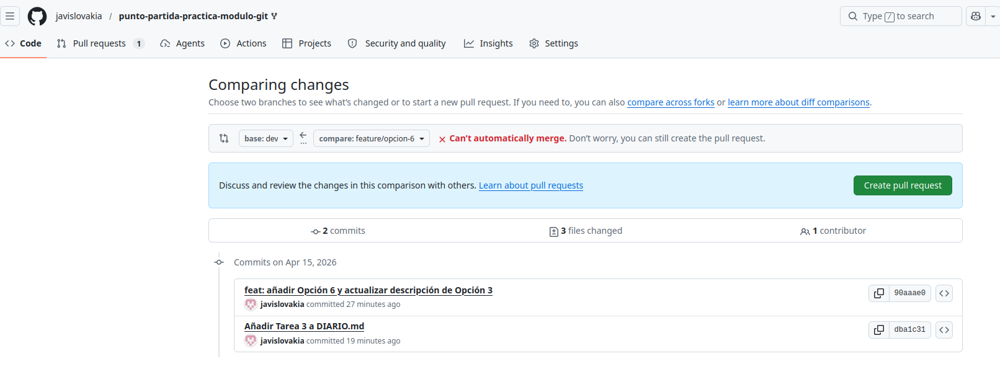
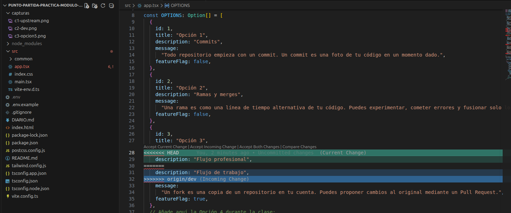
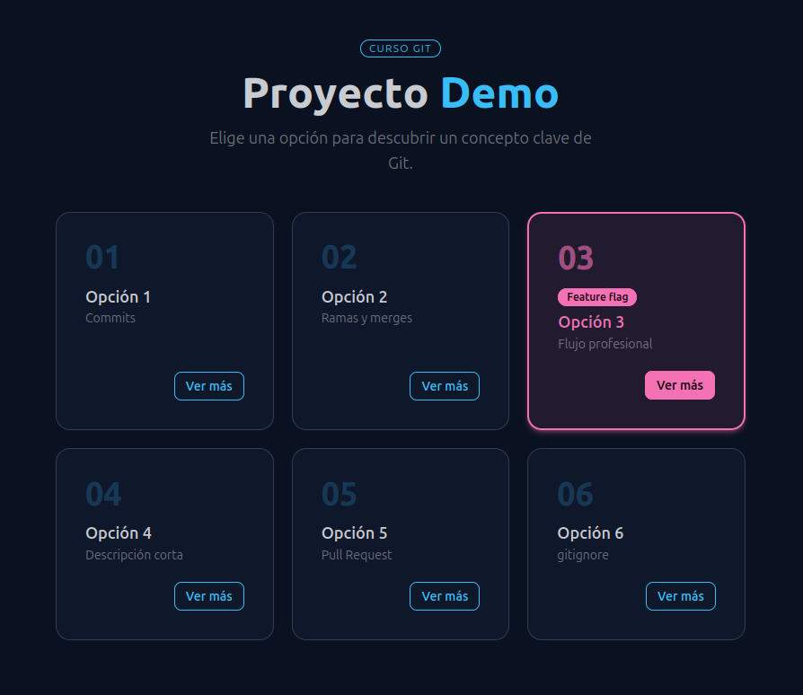
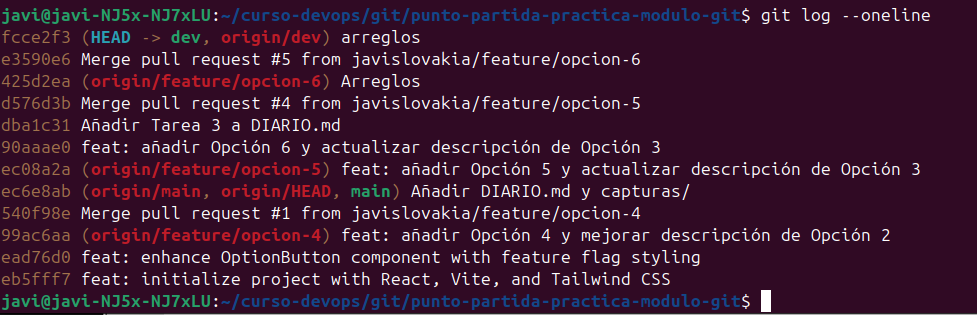

# TAREAS:
## Tarea 1 - Fork y configuración inicial
Un **fork** es una copia que se hace de un proyecto, aunque no es una copia totalmente independiente. La idea del fork es mantener una relación con el proyecto desde el que se hizo la copia. De esa forma, si hay un cambio en el proyecto original puedes aplicar dichos cambios a tu copia para mantenerla actualizada.

También se pueden hacer cambios en la otra dirección, se puede proponer que los cambios en tu copia del proyecto se apliquen al proyecto original. En git para interactuar con el proyecto original se configura su dirección como **upstream**. Cuando se hace un pull de upstream, te traes los cambios que se hicieron en el proyecto original desde que creaste el fork (o desde que hiciste el ultimo pull de upstream).

*Captura 1: Origin y Upstream*

*Captura 2: Rama DEV*

## Tarea 2 - Feature branch A: añadir la Opción 5
Para añadir nuevas funcionalidades es mejor trabajar con la rama de **dev** para así mantener la rama principal **main** limpia y estable. Haciéndolo así, si hiciera falta aplicar un hotfix a main para arreglar algún problema en la aplicación, no arrastramos cambios que no están completados o que no están totalmente testeados.

*Captura 3: Opción 5 añadida*

## Tarea 3 - Feature branch B: añadir la Opción 6 (aquí está el conflicto)
Un **conflicto en Git** sucede cuando se intentan aplicar varios cambios a una misma parte del código, y Git no sabe cuál de los cambios aplicar.

En nuestro caso los cambios de *feature/opcion-5* y *feature/opcion-6* incluyen una modificación de la descripción de la opción 3. Ambos parten de DEV, y lo modifican. Git no sabe qué cambio es el que preferimos.

## Tarea 4 - Pull Request 1: Feature A a dev
Cuando se hace un **Pull Request** Github confirma si el *merge* se puede hacer de forma automática o no. En cualquier caso, siempre es útil y recomendable revisar los cambios. Dentro del PR, en la pestaña de *Files Changed* se compara el contenido que va a ser cambiado, es decir, cómo era ese archivo y cómo será después de aplicar los cambios.

## Tarea 5: Pull Request 2: Feature B a dev
Los marcadores en VS Code dan información sobre el conflicto. 
* <<<<< indica el inicio del conflicto, primero indica el contenido de la rama en la que estás situado. Es el **Current Change**
* ====== es el divisor entre los cambios, es un separador.
* >>>>>> indica el **Incoming Change**, los cambios en la rama que estás intentando fusionar.

En nuestro caso, el criterio a seguir ha sido las indicaciones del ejercicio.

*Captura 5: PR conflicto*

*Captura 6: VScode conflicto*

*Captura 7: App opciones*

## Tarea 6 — Limpieza y cierre del diario
No había usado Git antes, todo ha sido nuevo para mí. Ahora comprendo mucho mejor qué hace Git, para qué sirve, cómo se usa, etc. Estoy más cómodo con la herramienta, quizás más cómodo con la terminal que usando VS Code. Supongo que es porque lo he practicado más.

Me ha llevado tiempo hacerlo y he encontrado problemas debido a mi falta de experiencia. Por ejemplo, como buen boy scout me puse a "arreglar" unos espacios e indentaciones que había, y luego se formó un pequeño lío cuando fui a hacer el merge. 

*Captura 8: Commits*

# Tareas adicionales
## Opcional 1 — Feature flag
**.env** no está en Git porque puede contener información sensible necesaria para ejecutar la aplicación en una máquina determinada, se guarda información de variables locales.

**.env.example es como una plantilla para .env. No contiene información real, pero puede servir de referencia para que cada programador se cree el archivo .env en su entorno de trabajo.

## Opcional 2 — PR final: dev a main
Hacer el release desde dev nos garantiza que el código está integrado. Hay veces que los cambios en una feature pueden afectar de forma inesperada, todo eso se prueba en dev, y una vez testeado se hace el release a main.