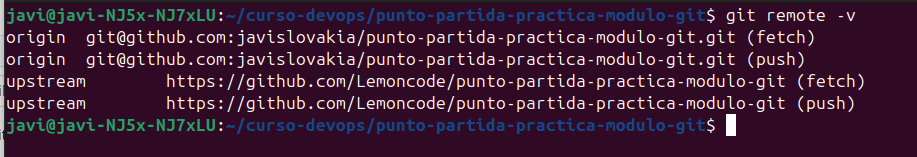
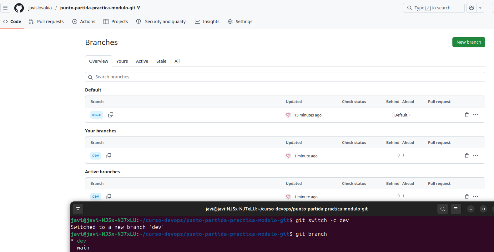
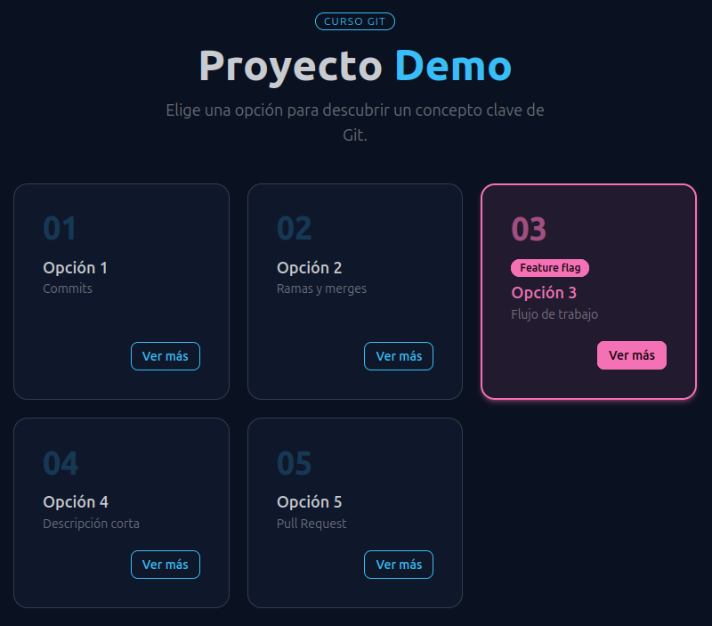

# TAREAS:
## Tarea 1 - Fork y configuración inicial
Un **fork** es una copia que se hace de un proyecto, aunque no es una copia totalmente independiente. La idea del fork es mantener una relación con el proyecto desde el que se hizo la copia. De esa forma, si hay un cambio en el proyecto original puedes aplicar dichos cambios a tu copia para mantenerla actualizada.

También se pueden hacer cambios en la otra dirección, se puede proponer que los cambios en tu copia del proyecto se apliquen al proyecto original. En git para interactuar con el proyecto original se configura su dirección como **upstream**. Cuando se hace un pull de upstream, te traes los cambios que se hicieron en el proyecto original desde que creaste el fork (o desde que hiciste el ultimo pull de upstream).

*Captura 1: Origin y Upstream*

*Captura 2: Rama DEV*

## Tarea 2 - Feature branch A: añadir la Opción 5
Para añadir nuevas funcionalidades es mejor trabajar con la rama de **dev** para así mantener la rama principal **main** limpia y estable. Haciéndolo así, si hiciera falta aplicar un hotfix a main para arreglar algún problema en la aplicación, no arrastramos cambios que no están completados o que no están totalmente testeados.

*Captura 3: Opción 5 añadida*

## Tarea 3 - Feature branch B: añadir la Opción 6 (aquí está el conflicto)
Un **conflicto en Git** sucede cuando se intentan aplicar varios cambios a una misma parte del código, y Git no sabe cuál de los cambios aplicar.

En nuestro caso los cambios de *feature/opcion-5* y *feature/opcion-6* incluyen una modificación de la descripción de la opción 3. Ambos parten de DEV, y lo modifican. Git no sabe qué cambio es el que preferimos.
